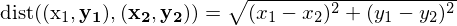
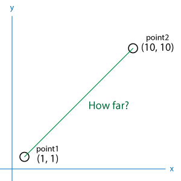

# Python基本①
## 前置き
### プログラムって？
* 「コンピュータへの命令書」
* もしxxxがxxxならばxxxxせよ（条件）
* xxxがxxxになるまでずっとxxxxし続けろ（ループ）
* この命令書を書くことが「プログラミング」、命令書を書くときに使う言葉が「プログラミング言語」
### Pythonって？
* 汎用のプログラミング言語
* 必要な処理を最小限のコードで書けるようにデザインされている
### Pythonを使うには？
* オンライン実行環境「[paiza.io](https://paiza.io/ja)」上でコードを書いて実行することができる
* 本格的にやるなら、自分のパソコン（ローカル）のなかでコードを実行できるようにローカル開発環境を用意する
  1. [Python本体](https://www.python.org)をインストール
  2. コードを編集するためのエディタをインストール（[Atom](https://atom.io)）

※開発環境の用意はいろいろ大変なので勉強会とは別枠でサポートします

## チュートリアル
公式のチュートリアルを参考に作成しているので、詳しいことを知りたい場合はこちらをご覧ください。
https://docs.python.jp/3/tutorial/

### 0.今回のゴール
**座標空間における[2点間の距離](https://juken-mikata.net/how-to/mathematics/distance-between-two-points.html)を計算する関数を作って、使ってみる**
#### 2点間の距離の公式


#### イメージ


### 1. 変数
データにつけるラベルのこと
#### 例
```
x1 = 1
x2 = 100
print(a*b)
```

## 2. データ型
* 「文字列」や「整数」のような、データの種類のこと。
* データ型の整合性が取れていないとエラーになる
  * e.g. 文字列と整数を足し算させようとする

| Pythonでの呼び方 |desc |
|:---|:---|
|str |文字列。コード上ではクォーテーションorダブルクォーテーションで囲むことで中身が文字列だということを明示する |
|int |整数 |
|float |浮動小数点数。少数を扱う |
|complex |複素数。ほぼ使わない |
|bool |論理値。`True`もしくは`False`の二値しかない。if文などで使う |

## 3. データ構造
データの保持の仕方のこと。
###

## 4. 関数
* 処理内容を予め定められた手続きのこと
* 処理に使うための値を渡すこともできる（この値を「引数（ひきすう）」と呼ぶ）
* 中高数学の「関数」やExcelの「関数」と全く同じ
  * f(x) = x+1 -> 引数xを渡すと、xに1足した数を出してくれる関数
  * SUM(1,2,3) -> 引数として渡した値をすべて合計して出してくれる関数
* 処理内容の最後の行の行末まで処理が終わるか、return文を使うと関数の処理は終了する
* return文は関数の終わりを明示するために必ず使おう
* `return 値`で値を関数の実行結果として返す（返り値）

### 関数の宣言
**文法**
```
def 関数名(引数):
    処理内容
    return 返り値
```

**例**
```
def total(a, b):
    return a+b
```
### 関数の使用
**文法（返り値がない場合）**
```
関数名(引数)
```
or
**文法（返り値がある場合）**
```
実行結果 = 関数名(引数)
```
**例**
```
total(a, b)
```
or
```
result = total(a, b)
```

## 演習
**座標空間における[2点間の距離](https://juken-mikata.net/how-to/mathematics/distance-between-two-points.html)を計算する関数を作って、結果を出力させてみよう**


```
# 平方根を計算するためのパッケージを読み込む
import math

# 関数の定義
def dist(point1, point2):
  # 2点のリストから座標を分解して変数に代入
  x1 = point1[0]
  y1 = point1[1]
  x2 = point2[0]
  y2 = point2[1]

  # 2点間の距離の公式に基づいて計算
  r = (x1 - x2)**2 + (y1 - y2)**2
  sq = math.sqrt(r)

  # 計算結果を返す
  return sq

# 関数の使用（座標はリストの形で渡す）
d = dist([5, 5], [10, 10])

# 結果をターミナル（コマンドプロンプト）上に出力
print(d)
```

## Appendix
### Pythonの特徴
#### インタープリタ型言語である
* 人間が分かる高水準言語を機械がその場で解釈しながら実行する
  * メリット
    * 修正が容易
    * 配布のしやすさ（ソースを配布するだけでいい）
  * デメリット
    * 実行速度が遅い
* cf. コンパイラ型言語
  * 高水準言語で書かれた原文（ソース）を、あらかじめ機械が分かる低水準言語に翻訳しておく
  * 翻訳されていつでも機械が読めるようになった状態のプログラムを「ビルド」と呼ぶ
#### 動的型付け言語である
* 書き手がデータ型を指定しなくても、プログラム実行時に機械が自動的にデータ型の整合性をチェックする
* データ型を気にせず柔軟にコーディングできるが、プログラム実行時にエラーが出やすい
* cf. 静的型付け言語
  * 書き手がプログラムを書くときにデータ型まで指定する
  * コンパイル時に整合性がチェックされる
  * プログラム実行時にエラーが出にくい
#### オブジェクト指向である
**説明①**
ポケモン（とくにイーブイ）みたいなもの


1. イーブイをモンスターボールから出す（インスタンスの作成）
2. イーブイのたいあたり！（メソッドの呼び出し）
3. イーブイに かみなりのいしを持たせて サンダースに進化させる（継承）
4. サンダースに わざマシンで でんこうせっかをおぼえさせる（メソッドの追加）
5. サンダースのでんこうせっか！（追加したメソッドの呼び出し）
6. サンダースのたいあたり！（継承したメソッドの呼び出し）

**説明②**
便利な道具箱


* 道具箱自体の作り方を事前に書いておく（クラスの定義）
* 必要なときに道具箱を用意する（インスタンスの作成）
* 道具箱に入っている道具を使用する（メソッドの呼び出し）
* 新しい道具を追加したアップグレード版の道具箱を作る（継承・メソッドの追加）

※ちゃんとした説明は難解なので、とりあえずここまでで勘弁してください。この[記事](https://codezine.jp/article/detail/10215)とかがわかりやすいかも？（書籍の紹介記事なので詳しいことは載ってないけど）
