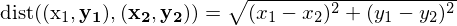
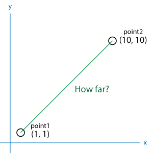

# Pythonの基本

## 前置き
### プログラムって？
* 「コンピュータへの命令書」
* もしxxxがxxxならばxxxxせよ（条件）
* xxxがxxxになるまでずっとxxxxし続けろ（ループ）
* この命令書を書くことが「プログラミング」、命令書を書くときに使う言葉が「プログラミング言語」
### Pythonって？
* 汎用のプログラミング言語
* 必要な処理を最小限のコードで書けるようにデザインされている
### Pythonを使うには？
* オンライン実行環境「[paiza.io](https://paiza.io/ja)」上でコードを書いて実行することができる
* 本格的にやるなら、自分のパソコン（ローカル）のなかでコードを実行できるようにローカル開発環境を用意する
  1. [Python本体](https://www.python.org)をインストール
  2. コードを編集するためのエディタをインストール（[Atom](https://atom.io)）

※開発環境の用意はいろいろ大変なので勉強会とは別枠でサポートします

## 今回のゴール

**座標空間における[2点間の距離](https://juken-mikata.net/how-to/mathematics/distance-between-two-points.html)を計算する関数を定義したうえで、計算結果をターミナル（コマンドプロンプト）上に出力する**

### 2点間の距離の公式


### イメージ


### 必要な知識
これからやる以下のセクションの知識を使えば、目的の関数が実装できるようになります。
* Sec.1 変数
* Sec.2 四則演算
* Sec.3 mathモジュールをimportして平方根を計算しよう
* Sec.4 データ型を変換しよう
* Sec.5 タプルにxy座標を保存しよう
* Sec.6 関数を定義しよう

### 解答
はじめに解答を示しておきます。コードの各部分に、そこで必要な知識が書いてあるセクションの番号を示しました。

※Pythonではコードの中にある`#`から始まる部分は「コメント」扱いとなり、処理の対象になりません。

```
# 平方根の計算に必要なmathモジュールの読み込み（Sec.3）
import math

# 計算したい2点をタプルとして変数に格納（Sec.1 & Sec.5）
point1 = (5, 5)
point2 = (10, 10)

# 関数の宣言（Sec.6）
def dist(point1, point2):
  # 各点のタプルからxy座標をそれぞれ取り出して変数に保存する（Sec.1 & Sec.5）
  x1 = point1[0]
  y1 = point1[1]
  x2 = point2[0]
  y2 = point2[1]

  # 2点間の距離の公式を実装（Sec.2 & Sec.3）
  r = (x1 - x2)**2 + (y1 - y2)**2
  sq = math.sqrt(r)

  # 計算結果を文字列と結合して返り値にする（Sec.4 & Sec.6）
  return "2点の距離: " + str(sq)

# 関数の使用（Sec.6）
d = dist(point1, point2)

# ターミナル（コマンドプロンプト）上に出力
print(d)
```
以下は公式のチュートリアルを参考に作成しているので、もっと詳しいことを知りたい場合はこちらをご覧ください。
https://docs.python.jp/3/tutorial/

## Sec.1 変数
変数とは「データにつけるラベル」のこと。プログラムではいろんなデータを変数に入れて管理しています。

### 例
```
x1 = 1
x2 = 100
print(a*b)
```

## Sec.2 四則演算
何か計算をするときに欠かせない四則演算。Pythonでは「割り算の商や余り」、2点間の距離の公式で使う「べき乗」も簡単に計算できます。

|演算子 |説明 |例 |
|:---|:---|:---|
|+ |足し算 |1 + 100 |
|- |引き算 |9 - 8 |
|* |掛け算 |12 * 19 |
|/ |割り算 |9 / 2 |
|// |割り算の商のみ |9 // 2 |
|% |割り算の余りのみ |9 % 2 |
|** |べき乗 |10**2 |
### 例1
```
print((1-100)**2 + (1-100)**2)
```
### 例2
```
x1 = 1
y1 = 1
x2 = 100
y2 = 100

print((x1-x2)**2 + (y1-y2)**2)
```

## Sec.3 mathモジュールをimportして平方根を計算しよう
実は、四則演算やべき乗だけでは、2点間の距離の公式は再現できません。公式をよく見てください。気づきましたか？「平方根」の存在に。


Pythonには何もしなくても使える「組み込み関数」が用意されていますが、「平方根」のような複雑なことをしたい場合は、専用のモジュールやパッケージを読み込ませておく必要があります。

### 組み込み関数
Pythonでは組み込み関数として、以下のようなものが使えます。
* `print()`
  * 引数を文字列としてターミナル（コマンドプロンプト）上に出力する
  * 複数の引数を与えると連続で出力してくれる
  * e.g. `print("kazu->", 123)`
* `sum()`
  * 数値を入れたリストを引数として与えるとその合計値を返してくれる
  * e.g. `sum([1,2,3,4,5,6,7,8,9,10])`
* `len()`
  * 文字列を引数として与えるとその文字数を返してくれる
  * e.g. `len("heyho")`
* `round()`
  * 少数を第1引数として与えると四捨五入してくれる
  * 第2引数に整数を渡すと少数第n位までの四捨五入をする
  * e.g. `round(3.14)` →3
  * e.g. `round(3.14, 1)` →3.1

その他は[公式ドキュメント](https://docs.python.jp/3/library/functions.html)から

### 標準モジュール
Pythonで最初から使えるのは組み込み関数だけではありません。「標準モジュール」を必要に応じて読み込むことで、いろいろな関数を使えるようになります。

* `import モジュール名`でモジュールを読み込み、`モジュール名.関数名()`でそのモジュールに入っている関数を使用できる
* 今回必要な「平方根」は、`math`モジュールに入っている`squrt()`関数を使って計算できる
#### `math`
* 計算で便利な関数が入ったモジュール
* e.g. `math.sqrt(4)` 4の平方根を計算する
```
import math

print(math.sqrt(4)) #4の平方根
print(math.floor(3.14)) #小数点以下を切り捨て
```

### パッケージ
有志が作ったパッケージを利用することでもっといろいろなことができるようになります。

※詳細は次回

## Sec.4 データ型を変換しよう
ここまでで、2点間の距離の公式を使って目的の数値を求めることができるようになりました。さらに欲張りを言えば、「2点の距離: 」という文字列をくっつけて出力したい。ただ数字が出てくるだけでは、それが何の値か分かりませんもんね。

でも、そう簡単にはいきません。数値（整数や少数）と文字列はデータ型が違うので、そのままでは結合できないのです。

### データ型とは
データ型とは、「文字列」や「整数」のようなデータの種類のことです。

* データ型の整合性が取れていないとエラーになる
  * e.g. 文字列と整数を足し算させようとする
* データ型を変換するには、`データ型の名前(変換したい値)`とする
  * e.g. `str(100)` 整数100→文字列"100"

|Python用語 |説明 |
|:---|:---|
|str |文字列。コード上ではクォーテーションorダブルクォーテーションで囲むことで中身が文字列だということを明示する |
|int |整数 |
|float |浮動小数点数。少数を扱う |
|complex |複素数。ほぼ使わない |
|bool |論理値。`True`もしくは`False`の二値しかない。if文などで使う |

### 例1
```
i = 100
s = "円です"

print(i + s) # TypeError: unsupported operand type(s) for +: 'int' and 'str'
```

### 例2
```
i = 100
s = "円です"

print(str(i) + s) # エラーが出ない
```

## Sec.5 タプルにxy座標を保存しよう
今回計算に使うのは点の「xy座標」です。つまり、ひとつの点は「x座標」と「y座標」のふたつの値を持つことになります。

あれ、ちょっと待ってください。ここまでで学んだのは、`x = 1`とか`y = 10`とか、変数と数値が1:1の関係になっているようなデータの持ち方。xy座標を表現するには、これとは違うデータ構造に値を格納する必要がありそうです。

そこで、「タプル」というデータ構造のなかに座標を保存しましょう。タプルとよく似たデータ構造に「リスト」というのもあるので、一緒に説明します。

※「データ構造」とは、データの保持の仕方のこと。例えば配列や行列など、データにはいろんな持ち方があります。。ここで上げたものの他にも[辞書型（dict）](https://docs.python.jp/3/tutorial/datastructures.html#dictionaries)や[集合型（set）](https://docs.python.jp/3/tutorial/datastructures.html#sets)というデータ構造もありますが、ここでは扱いません。

### リスト型（list）
* 複数の値を格納するための固まり
* ひとつずつ順番に取り出しながら処理したいときなどに使う
* コンマ`,`区切りの値 (要素) の並びを、角カッコ`[]`で囲むことで表現する
  * e.g. `l = [0,1,2,3,4]`
* リストのなかの特定の要素を取り出したいときは、`リスト[何番目]`と書く
  * **注意** リストの順番（index）は0から始まる
  * 1番目の要素を取り出すときは`リスト[0]`になる

#### 例1
```
l = [0,1,2,3,4]
print(l)
```
#### 例2
```
l = [0,1,2,3,4]
print(l[0], l[3])
```

### タプル型（tupple）
* リストと似てるが、**後から値を変更できない**
* タプルでは角カッコの代わりに丸カッコ`()`を用いる
  * e.g. `t = (0,1,2,3,4)`
* 複数の値の組み合わせをひとつのデータとして表現するときに使う
  * e.g. 点の座標
#### 例
```
point = (1, 10)
print("x: ", point[0], "y: ", point[1])
```
おめでとう！例のようにすると、xy座標を適切なデータ構造で保存できます。

## Sec.6 関数を定義しよう
さて、ここまで学んだ知識を使って処理をまとめましょう。

よく使う処理内容を関数として定義しておくと、好きなタイミングで好きな値を渡して計算させることができます。重複するコードは関数にまとめておくと、見やすいしメンテナンスが楽になります。

### 関数とは
* 関数とは、「処理内容をあらかじめ定められた箱」のこと
* 処理に使うための値を渡すこともできる（この値を「**引数（ひきすう）**」と呼ぶ）
* 中高数学の「関数」やExcelの「関数」と全く同じ
  * f(x) = x+1 -> 引数xを渡すと、xに1足した数を出してくれる関数
  * SUM(1,2,3) -> 引数として渡した値をすべて合計して出してくれる関数

### 関数の宣言
`def`から始まる1行で関数の名前と、その関数の処理で使用する引数を宣言します。処理内容は上から下に向かって順番に実行されますが、`return`文が現れた時点で処理は終了します。引数は何個でも使用することができます。

#### 文法
```
def 関数名(引数1, 引数2...):
タブ処理内容
タブreturn 返り値
```

#### 例
第1引数と第2引数を足して返す。処理内ではそれぞれa, bという変数として扱っている。
```
def total(a, b):
    return a+b
```

#### 階層構造はインデント（タブ）で表現する
* 処理内容は、関数の**中身**。
* こういった入れ子の構造（何かが何かの中身である構造）を示すとき、Pythonでは**インデント**（タブ×1もしくは半角スペース×4）を使う
* インデントによる階層構造の表現は、関数の宣言以外も使う。難しいけどこれ重要。

#### `return`文
* `return 値`で関数の処理を終了して、値を関数の実行結果として返す（この値を「**返り値**」と呼ぶ）
* `return`だけだと、処理はされるが実行結果は返ってこない
* `return`文がない場合、処理内容の最後の行まで実行されたらその関数の処理は終了扱いになる


### 関数の使用
`関数名(引数1, 引数2...)`で定義しておいた関数を実際に使用します。

#### 文法
##### 返り値がない場合（もしくは返り値を保存する必要がない場合）
```
関数名(引数1, 引数2...)
```
##### 返り値がある場合
```
実行結果 = 関数名(引数1, 引数2...)
```
#### 例
上で定義したtotal関数に、第1引数=1、第2引数=10を渡して実行（total関数の処理内ではa=1, b=10として処理される）
##### 返り値がない場合
```
total(1, 10)
```
##### 返り値がある場合
```
result = total(1, 10)
```

## 演習
ここまでで、ゴールに到達するための知識はすべて学ぶことができました。では、あらためて今回のお題です。

**座標空間における[2点間の距離](https://juken-mikata.net/how-to/mathematics/distance-between-two-points.html)を計算する関数を定義したうえで、計算結果をターミナル（コマンドプロンプト）上に出力する**

このページの上部に戻れば解答を見ることができますが、できれば解答を見返すことなく実装してほしい！

### 2点間の距離の公式


### イメージ


## Appendix（おまけ）
### Pythonの特徴
#### インタープリタ型言語である
* 人間が分かる高水準言語を機械がその場で解釈しながら実行する
  * メリット
    * 修正が容易
    * 配布のしやすさ（ソースを配布するだけでいい）
  * デメリット
    * 実行速度が遅い
* cf. コンパイラ型言語
  * 高水準言語で書かれた原文（ソース）を、あらかじめ機械が分かる低水準言語に翻訳しておく
  * 翻訳されていつでも機械が読めるようになった状態のプログラムを「ビルド」と呼ぶ
#### 動的型付け言語である
* 書き手がデータ型を指定しなくても、プログラム実行時に機械が自動的にデータ型の整合性をチェックする
* データ型を気にせず柔軟にコーディングできるが、プログラム実行時にエラーが出やすい
* cf. 静的型付け言語
  * 書き手がプログラムを書くときにデータ型まで指定する
  * コンパイル時に整合性がチェックされる
  * プログラム実行時にエラーが出にくい
#### オブジェクト指向である
**説明①**
ポケモン（とくにイーブイ）みたいなもの


1. イーブイをモンスターボールから出す（インスタンスの作成）
2. イーブイのたいあたり！（メソッドの呼び出し）
3. イーブイに かみなりのいしを持たせて サンダースに進化させる（継承）
4. サンダースに わざマシンで でんこうせっかをおぼえさせる（メソッドの追加）
5. サンダースのでんこうせっか！（追加したメソッドの呼び出し）
6. サンダースのたいあたり！（継承したメソッドの呼び出し）

**説明②**
便利な道具箱


* 道具箱自体の作り方を事前に書いておく（クラスの定義）
* 必要なときに道具箱を用意する（インスタンスの作成）
* 道具箱に入っている道具を使用する（メソッドの呼び出し）
* 新しい道具を追加したアップグレード版の道具箱を作る（継承・メソッドの追加）

※ちゃんとした説明は難解なので、とりあえずここまでで勘弁してください。この[記事](https://codezine.jp/article/detail/10215)とかがわかりやすいかも？（書籍の紹介記事なので詳しいことは載ってないけど）
